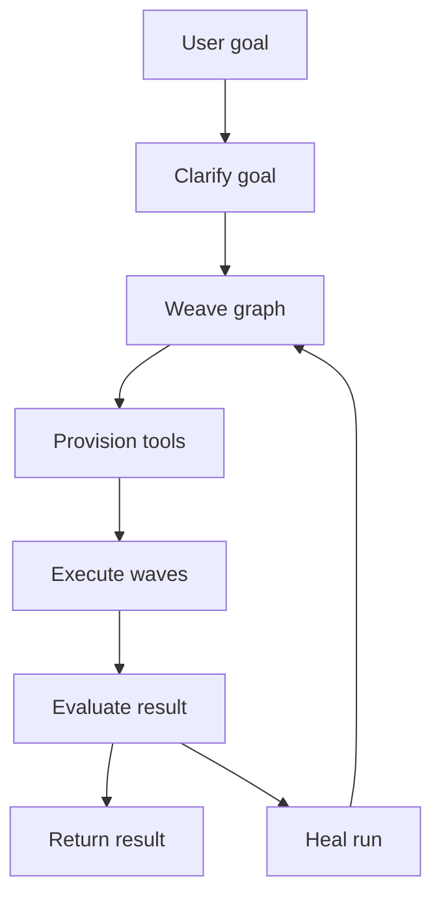
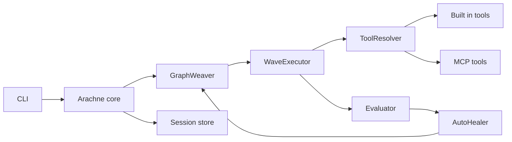

# <p align="center"></p>
# 🕷️ Arachne — DSPy-native runtime for self-healing agent graphs

[](https://opensource.org/licenses/MIT)
[](https://www.python.org/downloads/release/python-3110/)
[](https://github.com/Strategic-Automation/arachne/actions)
[](https://github.com/stanfordnlp/dspy)

**Stop prompting. Start programming.** Arachne turns natural-language goals into typed, inspectable, DSPy-native execution graphs. It weaves a directed graph, provisions tools, executes nodes in parallel waves, evaluates the output, and can repair or re-weave when a run fails.

> **Beta:** Arachne `0.1.x` is under active development. Interfaces may change while the runtime stabilises.

---

## Why Arachne?

Most agent systems are prompt chains wrapped in orchestration code. They are hard to inspect, hard to resume, and brittle when a tool fails. Arachne treats agent work as a graph-shaped programme:

| Problem | Arachne approach |
|---|---|
| Vague goals | Interactive goal clarification before execution |
| Brittle prompt chains | DSPy signatures and Pydantic topology models |
| Slow sequential plans | Topological wave execution with async concurrency |
| Lost state | Durable sessions, cached graphs, and checkpoints |
| Silent failure | Rules, semantic scoring, and human review gates |
| Expensive retries | Targeted retry, re-route, or re-weave repair strategies |

## Highlights

- **DSPy-native graph weaving** — goals become structured `GraphTopology` models rather than hidden prompt chains.
- **Parallel wave execution** — independent nodes run concurrently once their dependencies are satisfied.
- **Protocol-first tools** — built-in tools and MCP integrations share the same resolver path.
- **Self-healing loop** — failed or low-quality runs can be retried, re-routed, or re-woven.
- **Human oversight** — interactive mode lets users review and steer generated plans.
- **Session-first runtime** — every run has a durable local record for audit, resume, and reuse.

---

## Runtime lifecycle



## Architecture at a glance



---

## Quick start

### 1. Clone the repository

```bash
git clone https://github.com/Strategic-Automation/arachne.git
cd arachne
```

### 2. Run the setup wizard

```bash
./quickstart.sh
```

The wizard checks your Python and `uv` setup, installs dependencies, and helps create local configuration files.

### 3. Run your first goal

```bash
uv run arachne run "Research the current state of humanoid robotics"
```

For extra control, enable interactive review:

```bash
uv run arachne run "Research the current state of humanoid robotics" --interactive
```

### Optional Crawl4AI Web Extraction

For browser-rendered, LLM-ready Markdown extraction, install the optional Crawl4AI tool:

```bash
uv sync --extra crawl
uv run crawl4ai-setup
uv run crawl4ai-doctor
```

This enables the built-in `crawl4ai_fetch_async` tool for `http://` and `https://` pages.

---

## Common commands

```bash
# Weave and execute a goal
uv run arachne run "Create a market map for open-source agent runtimes"

# Generate a graph without running it
uv run arachne weave "Compare DSPy and LangGraph for graph-based agents"

# List recent sessions
uv run arachne ls -n 5

# Read the latest result
uv run arachne cat last

# List cached graph topologies
uv run arachne graphs

# Reuse a previous graph
uv run arachne rerun <graph-id>

# Resume a failed run
uv run arachne resume <session-id>
```

## Configuration model

Arachne supports project-level and user-level YAML configuration, but it does not merge those two YAML files. The loader selects `./arachne.yaml` when it exists; otherwise it falls back to `~/.arachne/config.yaml`. Runtime override values still take priority over the selected YAML file and built-in defaults.

For the full configuration flow, see [Architecture deep dive](docs/explanation/architecture.md).

---

## Documentation

| Need | Start here |
|---|---|
| Install and run your first goal | [Getting started](docs/tutorials/getting-started.md) |
| Understand the system design | [Architecture deep dive](docs/explanation/architecture.md) |
| Use the CLI well | [CLI reference](docs/reference/cli.md) |
| Browse all docs | [Documentation index](docs/index.md) |
| Contribute safely | [Contributor guide](docs/roadmap/contributing.md) |

---

## Project status

Arachne is suitable for experimentation, research workflows, and early integrator feedback. The current focus is reliability, observability, graph reuse, and clearer extension points for tools and skills.

Planned areas:

- richer graph review and editing
- stronger resumability around checkpoints
- semantic graph reuse
- cleaner event streaming
- expanded MCP integration patterns

See [ROADMAP.md](ROADMAP.md) for more detail.

---

## Contributing

Contributions are welcome. Useful starting points:

- open an issue with a focused bug report or proposal
- improve documentation or examples
- add tests around graph execution, tool resolution, or session recovery
- keep PRs small and easy to review

Before opening a PR, run:

```bash
uv sync --all-groups
uv run ruff check src/arachne tests
uv run pytest
```

## License

Arachne is released under the MIT License. See [LICENSE](LICENSE) for details.

