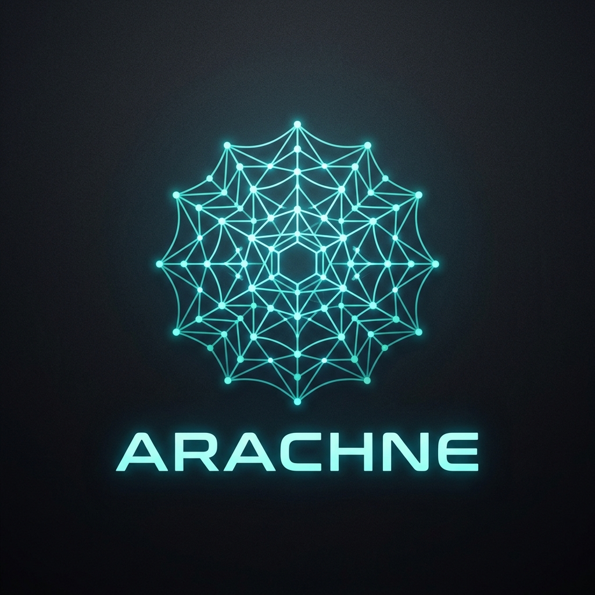

# <p align="center"></p>
# 🕷️ Arachne — The DSPy-Native Agent Runtime

[](https://opensource.org/licenses/MIT)
[](https://www.python.org/downloads/release/python-3110/)
[](https://github.com/Strategic-Automation/arachne/actions)
[](https://github.com/stanfordnlp/dspy)

**Stop Prompting. Start Programming.** Arachne is an open-source runtime for AI agents that replaces brittle prompt-chaining with DSPy-native optimized graphs. Describe your goal in natural language — Arachne weaves the topology, executes with protocol-first tools (MCP), and heals itself on failure.

> **Beta** — Arachne v0.1.0 is under active development. APIs may change.

## 💎 Why Arachne?

Traditional agent frameworks leave you fighting fragile prompts and manual debugging. Arachne inverts this:

| Pain Point | Arachne Solution |
|-----------|----------------|
| **Vague Goals** | **Intelligent Intake**: Asks clarifying questions *before* weaving the graph. |
| **Brittle Prompts** | **DSPy Signatures**: Compiled contracts that ensure type-checked reliability. |
| **Sequential Bottlenecks** | **Wave Parallelism**: Dynamic DAGs with concurrent async execution. |
| **Silent Failures** | **Autonomous Healing**: Self-diagnoses and re-weaves on quality drops. |
| **Black-Box Autonomy** | **Interactive Oversight**: Real-time feedback loops and final approval gates. |

---

## ⚡ Key Features

- **🧠 Goal Clarification** — Pauses to resolve ambiguity *before* execution in `--interactive` mode.
- **🎯 Declarative Logic** — DSPy Signatures define input/output contracts, not prompts.
- **🔀 Dynamic Graph Weaving** — LLM generates optimal execution DAGs for any goal.
- **⚡ Wave-Based Parallelism** — Concurrent node execution via `asyncio`.
- **🛡️ Triangulated Verification** — Quality gates: rules → semantic → human escalation.
- **🔄 Autonomous Self-Healing** — Diagnoses failures and re-weaves strategy on the fly.
- **🤝 Human-in-the-Loop** — Built-in checkpoints for manual approval and steering.
- **📦 Topology Reuse** — Hash-based caching for instant graph resumption.

---

## How It Works

```
┌─────────────────────────────────────────────────────────────────────┐
│  1. DESCRIBE YOUR GOAL                                             │
│     "Research the latest advances in humanoid robotics"                  │
└─────────────────────────────────────────────────────────────────────┘
                              │
                              ▼
┌─────────────────────────────────────────────────────────────────────┐
│  2. ARACHNE WEAVES THE GRAPH                                       │
│     ↓                                                              │
│  ┌─────────┐    ┌─────────┐    ┌─────────┐                       │
│  │ search │───▶│ fetch  │───▶│summarize│                       │
│  │  web  │    │content │    │findings│                       │
│  └─────────┘    └─────────┘    └─────────┘                       │
│     (parallel)        ↓                                      │
│                  [pointer pattern for large data]                 │
└─────────────────────────────────────────────────────────────────────┘
                              │
                              ▼
┌─────────────────────────────────────────────────────────────────────┐
│  3. EXECUTE & VERIFY                                              │
│     ↓                                                              │
│  • Wave 1: Search runs                                              │
│  • Wave 2: Fetch content (uses search results)                      │
│  • Wave 3: Generate report                                         │
│  • Evaluate: Triangulated quality check                             │
│     ↓                                                              │
│  [Success?] ──▶ Return Results                                    │
│     │                                                              │
│     └── [Failure?] ──▶ AutoHealer ──▶ Retry / Re-Weave            │
└─────────────────────────────────────────────────────────────────────┘
```

---

### Run Your First Agent

The easiest way to get started is with the interactive quickstart script:

```bash
./quickstart.sh
```

This will guide you through:
1. **Prerequisites check** (Python 3.11+, uv)
2. **LLM selection** (Ollama, OpenRouter, OpenAI, Anthropic)
3. **Environment setup** (generates `.env` and `arachne.yaml`)
4. **Tool provisioning** (web search, browser, etc.)

Once configured, run a goal:

```bash
uv run arachne run "Research the current state of humanoid robotics"
```

Arachne will:
1. **Weave** a graph from your goal
2. **Provision** tools (web search, fetch, etc.)
3. **Execute** in topological waves
4. **Verify** output quality
5. **Heal** if anything fails

### Other Commands

```bash
# View your last session report
uv run arachne cat last

# List recent sessions
uv run arachne ls -n 5

# Reuse a cached graph
uv run arachne rerun <graph-id>
```

---

## 🏗️ Architecture

```
goal → GraphWeaver (dspy.ChainOfThought) → GraphTopology (Pydantic)
                                              ↓
                                        WaveExecutor
                                        wave-based parallel execution
                                        via dspy.asyncify + gather()
                                              ↓
                                  TriangulatedEvaluator
                                              ↓
                                       AutoHealer
                              ↑           ↓ retry / re-weave
                              └───────────┘
```

- **GraphWeaver**: LLM generates optimized DAGs from goals
- **WaveExecutor**: Parallel node execution with dependency handling
- **TriangulatedEvaluator**: Three-level quality verification
- **AutoHealer**: Autonomous failure diagnosis and repair

---

## ⚙️ Configuration

Arachne uses a dual-file configuration strategy to separate secrets from settings:

- **`.env`** (Git-ignored): Stores your **secrets** (e.g., `LLM_API_KEY`, `LANGFUSE_SECRET_KEY`).
- **`arachne.yaml`** (Git-ignored): Stores **structured settings** (e.g., cost budgets, model IDs, observability flags).

The framework automatically merges these on startup, with environment variables taking highest precedence over file-based settings.

---

## 📚 Documentation

| Topic | Link |
|-------|------|
| Getting Started | [docs/tutorials/getting-started.md](docs/tutorials/getting-started.md) |
| Architecture Deep-Dive | [docs/explanation/architecture.md](docs/explanation/architecture.md) |
| CLI Reference | [docs/reference/cli.md](docs/reference/cli.md) |

---

## 🛤️ Roadmap

- **v0.3.0** — Wave-level checkpointing, session resume
- **v0.4.0** — Semantic topology search (vector-based reuse)
- **v0.5.0** — Event bus & live streaming

See [ROADMAP.md](ROADMAP.md) for full vision and milestones, and for detailed implementation tracking.

---

> [!IMPORTANT]
> **Stable** — Arachne v0.1.0 is the official production release.

---

## 🤝 Community & License

- **Issues**: [GitHub Issues](https://github.com/Strategic-Automation/arachne/issues)
- **License**: MIT (Strategic Automation Ltd.)