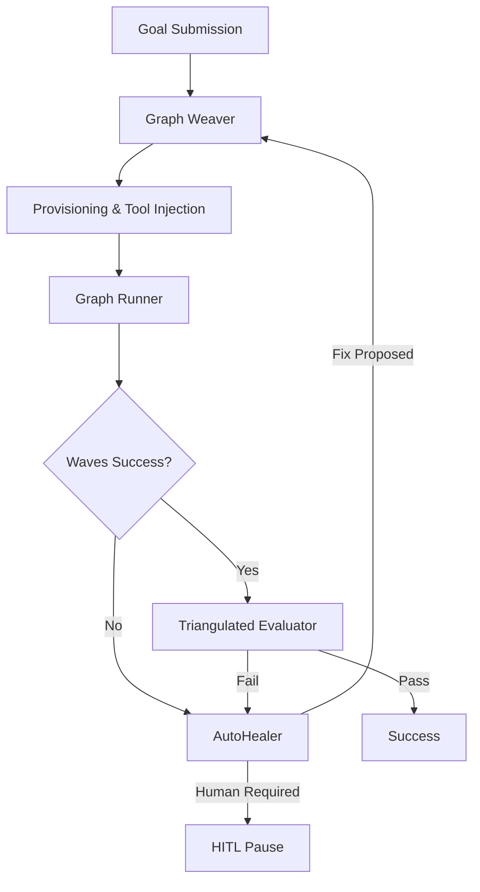

# Architecture Overview: Arachne

Arachne is a production-grade, self-healing AI agent runtime that executes autonomous tasks via dynamically generated DSPy-native graph topologies.

## Core Philosophy

- **Thin Orchestration, Thick Intelligence**: Minimal structural scaffolding; all "intelligence" lives in DSPy-native modules (Weaver, Evolver, Evaluator).
- **Silent Execution with Active Enrichment**: Agents run autonomously, discovering missing data via tool-use and context injection.
- **Self-Healing First, HITL Last**: Automatic detection of failures and re-weaving/re-routing before human intervention.
- **Stateful Persistence**: Every wave and node result is checkpointed to disk for reliability and resume-ability.

## System Components

Arachne is composed of several key modules working together:

1.  **Graph Weaver**: Generates the Directed Acyclic Graph (DAG) for a given goal.
2.  **Graph Runner**: Orchestrates the execution of nodes in waves.
3.  **Triangulated Evaluator**: Verifies the quality and correctness of results.
4.  **AutoHealer**: Diagnoses failures and applies recovery strategies.
5.  **MCP Manager**: Integrates with Model Context Protocol servers for dynamic tool discovery.

## Execution Flow

