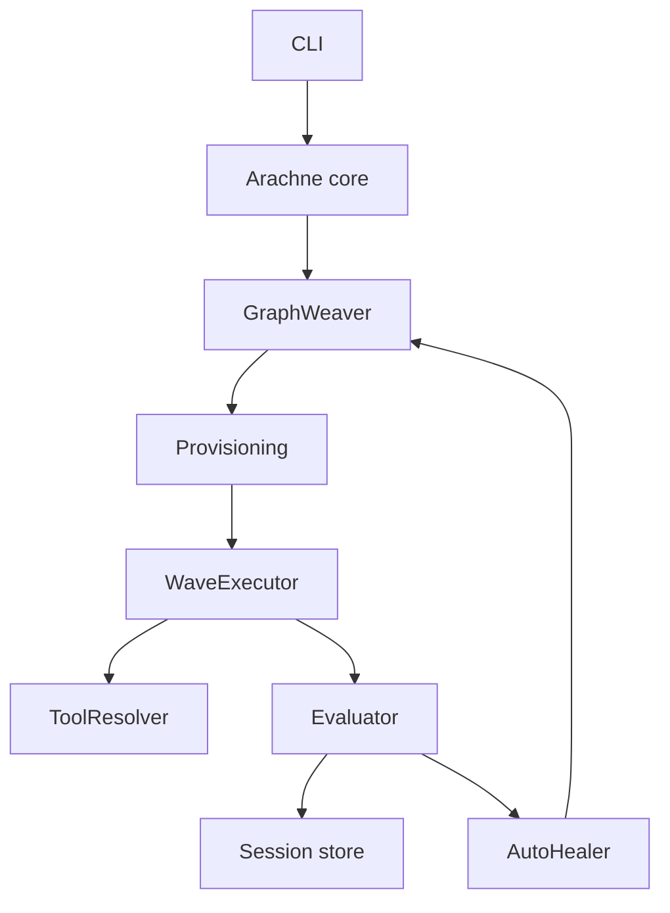
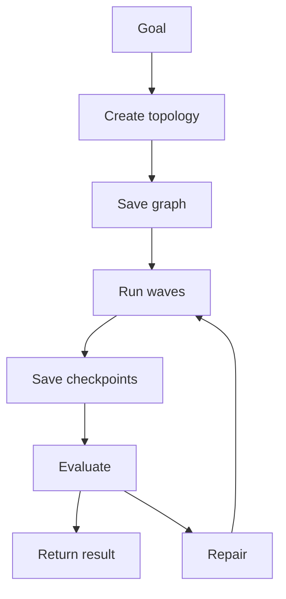
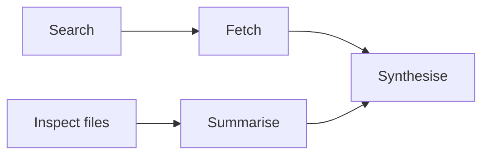
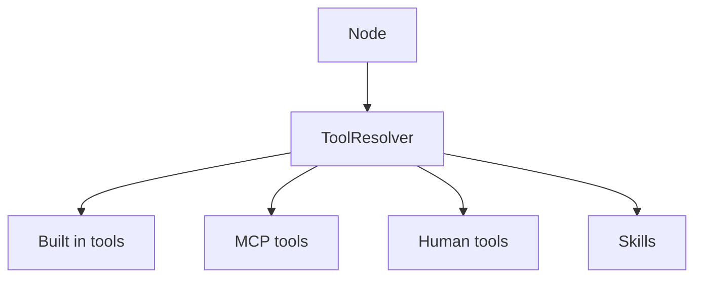
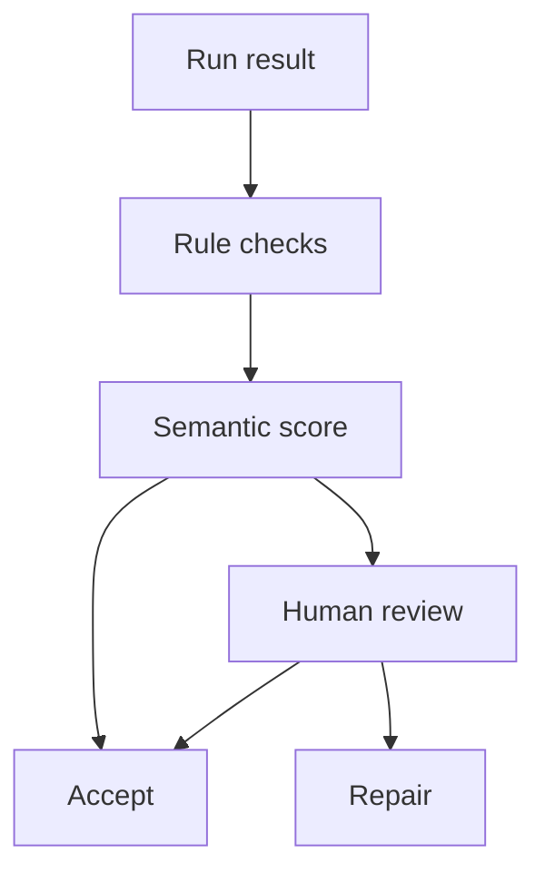
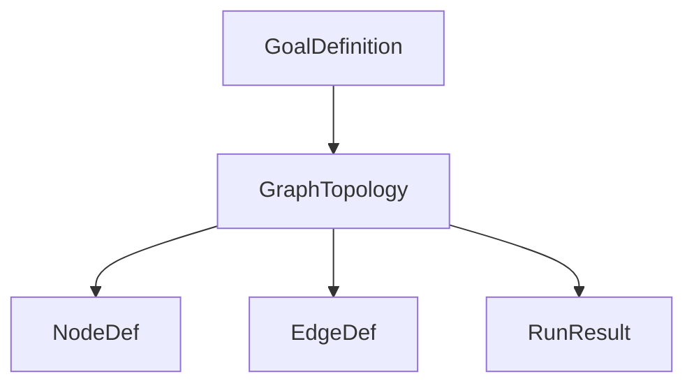
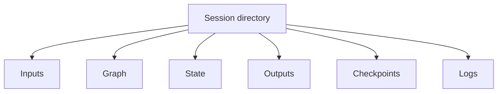
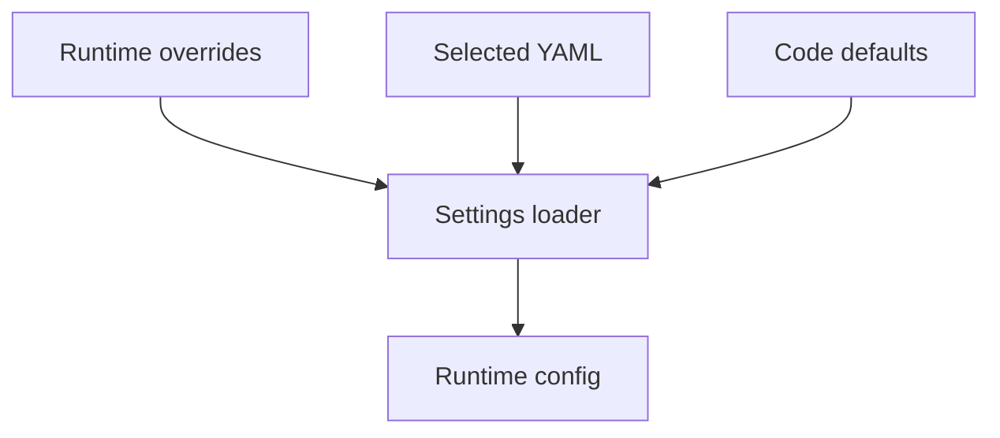
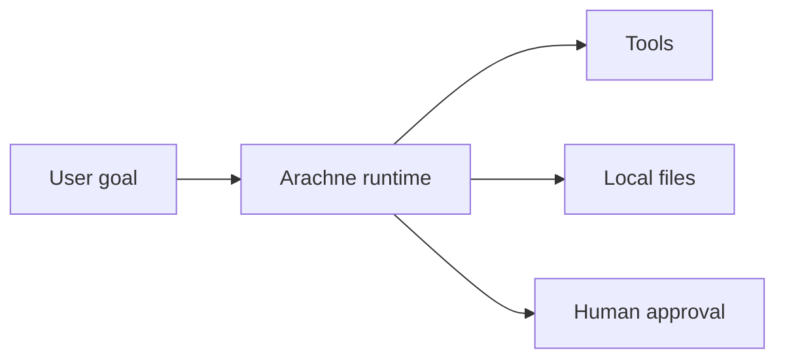

# Arachne architecture

Arachne is a DSPy-native runtime for goal-driven agent graphs. A user supplies a goal, Arachne turns it into a typed topology, executes that topology in dependency-aware waves, evaluates the result, and repairs the run when quality or execution checks fail.

## System goals

Arachne is designed around five principles:

1. **Graphs over prompt chains** — agent plans are explicit directed acyclic graphs.
2. **Typed contracts** — DSPy signatures and Pydantic models define interfaces.
3. **Parallel where safe** — independent graph nodes run in topological waves.
4. **Inspectable state** — sessions, graphs, checkpoints, and outputs are persisted.
5. **Repair over restart** — failures trigger retry, re-route, or re-weave strategies.

## High-level system



## Execution lifecycle



## Core components

### GraphWeaver

`GraphWeaver` transforms a goal into a `GraphTopology`. It defines nodes, dependencies, roles, inputs, outputs, required tools, and success criteria.

Responsibilities:

- convert natural-language goals into structured graph topology
- keep the graph acyclic and executable
- choose node roles such as `predict`, `chain_of_thought`, `react`, `human_in_loop`, or `recursive`
- produce topology metadata for caching and review

### WaveExecutor

`WaveExecutor` runs topology nodes in topological waves. Nodes in the same wave do not depend on each other and can run concurrently.



Execution rules:

- a node starts only when all upstream dependencies have completed
- wave failures prevent dependent downstream nodes from running blindly
- checkpointing captures progress after waves
- large tool outputs use the pointer pattern instead of overflowing model context

### ToolResolver

`ToolResolver` normalises access to tools from different sources.



This keeps node execution code independent of whether a tool is local, protocol-backed, or human-mediated.

### TriangulatedEvaluator

The evaluator combines multiple checks rather than trusting a single model judgement.



### AutoHealer

`AutoHealer` diagnoses failed runs and chooses a repair strategy.

| Strategy | Use when | Typical action |
|---|---|---|
| Retry | transient tool or network issue | re-run the failed node |
| Re-route | node instruction or tool choice is weak | adjust route or inputs |
| Re-weave | graph structure is wrong | generate a revised topology |

Circuit breakers prevent endless repair loops.

## Data model



## Session layout

Each run persists enough information to inspect, resume, and audit the graph.



Typical contents:

| Path | Purpose |
|---|---|
| `inputs.json` | original goal, context, and run options |
| `graph.json` | woven topology |
| `state.json` | node status and execution state |
| `outputs/` | durable node artefacts |
| `checkpoints/` | recovery snapshots |
| `logs/` | execution diagnostics |

## Configuration flow



Arachne selects a project YAML file when present, otherwise it falls back to the user-level config file. It does not merge those two YAML files together.

## Trust boundaries

Arachne executes tools and model-generated plans, so trust boundaries matter.



Guidelines:

- treat user goals and model-generated plans as untrusted inputs
- keep tool execution explicit and auditable
- prefer protocol-backed tools with narrow permissions
- require human approval for destructive or high-impact operations
- preserve session records for post-run review

## Source map

```text
src/arachne/
├── cli/                 # Typer CLI and terminal display
├── core.py              # Top-level Arachne module
├── execution/           # orchestration and execution manager
├── optimizers/          # DSPy optimiser support
├── runtime/             # evaluation, healing, provisioning, observability
├── sessions/            # durable session management
├── skills/              # reusable expert protocols
├── tools/               # built-in and protocol-backed tools
└── topologies/          # graph schema, weaving, node and wave execution
```

## Design patterns

### Graph-first planning

Planning output is a serialisable topology, not an opaque prompt. This makes runs inspectable and reusable.

### Pointer pattern

Large outputs are written to disk and replaced with a compact pointer plus preview. Downstream nodes can read the full artefact when needed.

### Wave execution

Topological waves provide concurrency without violating dependencies.

### Triangulated evaluation

Arachne combines deterministic, semantic, and human checks to avoid trusting a single judgement path.

### Repair loop

Failed runs are not simply restarted. The runtime chooses the smallest useful repair: retry, re-route, or re-weave.

## Related docs

- [Getting started](../tutorials/getting-started.md)
- [CLI reference](../reference/cli.md)
- [DSPy-native concepts](../key_concepts/dspy-native.md)
- [Pointer pattern](../key_concepts/pointer-pattern.md)
