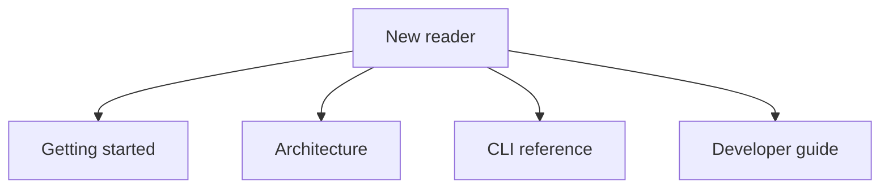

# Arachne documentation

Welcome to the Arachne documentation. Arachne is a DSPy-native runtime for turning goals into typed, inspectable, self-healing execution graphs.

The docs follow the [Diátaxis](https://diataxis.fr/) structure so readers can choose the right material for the job: tutorials for learning, guides for doing, explanation for understanding, and reference for exact details.

## Start here

| Reader goal | Recommended page |
|---|---|
| Install Arachne and run a first goal | [Getting started](tutorials/getting-started.md) |
| Understand the runtime lifecycle | [Architecture](explanation/architecture.md) |
| Learn command syntax | [CLI reference](reference/cli.md) |
| Work on the codebase | [Developer guide](guides/developer-guide.md) |
| Understand DSPy-native design | [DSPy-native concepts](key_concepts/dspy-native.md) |
| Understand large-output handling | [Pointer pattern](key_concepts/pointer-pattern.md) |

## Documentation map

## Tutorials

- [Getting started](tutorials/getting-started.md) — set up Arachne and run a first agent graph.

## Guides

- [Developer guide](guides/developer-guide.md) — local setup, workflow, and project conventions.
- [Testing guide](guides/testing.md) — running tests and understanding pytest configuration.
- [Creating skills](guides/creating-skills.md) — adding reusable expert protocols.
- [MCP setup](guides/mcp-setup.md) — connecting Model Context Protocol servers.

## Explanation

- [Architecture](explanation/architecture.md) — system design, graph lifecycle, data flow, and trust boundaries.
- [Architecture overview](architecture/overview.md) — high-level runtime view.
- [Graph orchestration](architecture/graph-orchestration.md) — topology weaving and execution.
- [MCP integration](architecture/mcp-integration.md) — tool integration design.
- [Self-healing](architecture/self-healing.md) — AutoHealer and recovery strategies.

## Concepts

- [DSPy-native](key_concepts/dspy-native.md) — why Arachne uses DSPy signatures over prompt chains.
- [Triangulated evaluation](key_concepts/triangulated-evaluation.md) — rules, semantic scoring, and human escalation.
- [Pointer pattern](key_concepts/pointer-pattern.md) — large-output spillover and downstream retrieval.

## Reference

- [CLI reference](reference/cli.md) — command syntax, options, and examples.
- [Schema reference](reference/schema.md) — Pydantic models and topology contracts.
- [Coding standards](reference/coding-standards.md) — style, linting, and review expectations.
- [Security Policy](reference/security.md) — policy and disclosure process.

## Project resources

- [README](../README.md) — public project landing page.
- [AGENTS.md](../AGENTS.md) — AI coding assistant context.
- [ROADMAP.md](../ROADMAP.md) — project vision, phases, and milestones.
