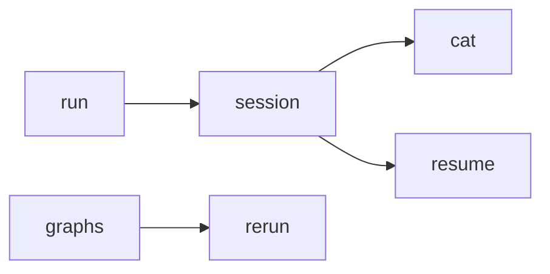
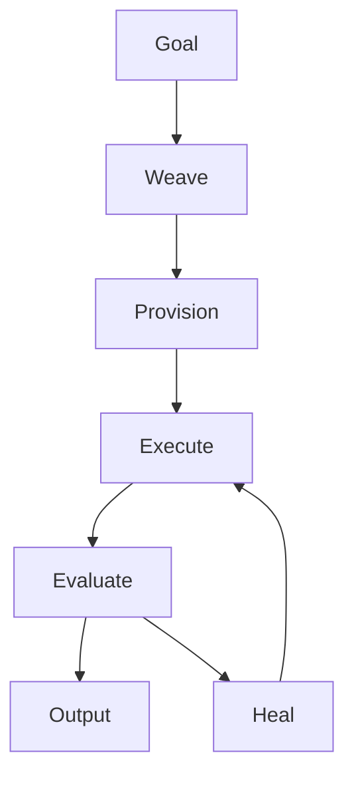
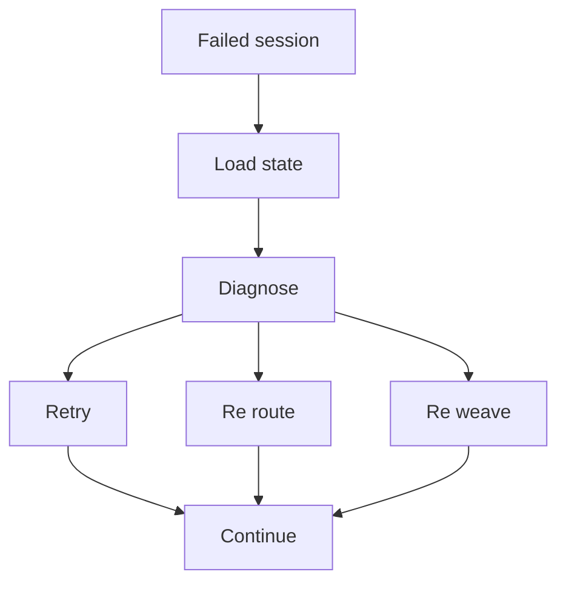

# CLI reference

Arachne exposes a Typer-based CLI for weaving, executing, inspecting, reusing, and recovering agent graphs.



## Global pattern

Most commands run through `uv` during development:

```bash
uv run arachne <command> [arguments] [options]
```

If Arachne is installed as a package, use:

```bash
arachne <command> [arguments] [options]
```

## Command summary

| Command | Purpose | Typical use |
|---|---|---|
| `run` | weave and execute a goal | normal end-to-end workflow |
| `weave` | generate a graph without executing it | review or cache a topology |
| `ls` | list recent sessions | find previous runs |
| `cat` | render a session result | inspect the latest or named output |
| `graphs` | list cached topologies | find reusable graph ids |
| `show` | visualise a session or graph | inspect topology structure |
| `rerun` | execute a previous topology | reuse a proven plan |
| `resume` | continue a failed or interrupted session | recover work |
| `clean` | remove old or failed sessions with filters | maintain local state |
| `compile-weaver` | compile GraphWeaver sub-predictors | improve topology generation |
| `config` | inspect or update local settings | manage runtime configuration |

## Core workflow commands

### `run`

Weave a graph from a natural-language goal and execute it immediately.

```bash
uv run arachne run "Research the current state of humanoid robotics"
```

With graph review:

```bash
uv run arachne run "Research the current state of humanoid robotics" --interactive
```

Common options:

| Option | Meaning |
|---|---|
| `--interactive`, `-i` | review or clarify the plan before execution |
| `--max-retries`, `-r` | control repair attempts |
| `--max-tokens` | override the run token budget |

Runtime flow:



### `weave`

Generate a graph topology without executing it.

```bash
uv run arachne weave "Compare graph-based agent frameworks"
```

Save the topology:

```bash
uv run arachne weave "Compare graph-based agent frameworks" --output graph.json
```

Use this command when you want to inspect structure before allowing a run.

## History and inspection

### `ls`

List recent sessions.

```bash
uv run arachne ls
uv run arachne ls -n 10
```

Typical columns:

| Column | Meaning |
|---|---|
| Session ID | unique run identifier |
| Created | timestamp or relative age |
| Goal | shortened goal text |
| Graph ID | topology cache identifier |
| Status | run state |

### `cat`

Render the final output for a session.

```bash
uv run arachne cat last
uv run arachne cat <session-id>
```

Use `last` for the most recent session.

### `graphs`

List cached graph topologies.

```bash
uv run arachne graphs
```

This is useful when you want to reuse a graph with `rerun`.

### `show`

Visualise a graph from either a session id or graph id.

```bash
uv run arachne show <session-id>
uv run arachne show <graph-id>
```

## Reuse and recovery

### `rerun`

Execute a fresh session using an existing topology.

```bash
uv run arachne rerun <graph-id>
```

Override the goal while keeping the graph structure:

```bash
uv run arachne rerun <graph-id> --goal "Research the same market in Europe"
```

### `resume`

Resume a failed or interrupted session.

```bash
uv run arachne resume <session-id>
```

Recovery flow:



## Maintenance commands

### `clean`

Remove old or failed session data. The command only deletes sessions when a filter is supplied.

```bash
# Delete sessions older than 30 days
uv run arachne clean --older-than 30

# Delete failed sessions
uv run arachne clean --failed
```

Use with care when you rely on session history for audit or reproducibility.

### `config`

Inspect or update local runtime settings.

```bash
uv run arachne config list
```

The exact supported actions may evolve while Arachne is in beta.

### `compile-weaver`

Compile the GraphWeaver sub-predictors with BootstrapFewShot.

```bash
uv run arachne compile-weaver --teacher <model> --max-demos 4
```

Options:

| Option | Meaning |
|---|---|
| `--teacher`, `-t` | teacher model for bootstrapping |
| `--max-demos`, `-n` | maximum number of bootstrapped demonstrations |
| `--output-dir`, `-o` | output directory for compiled predictors |

## Recommended workflows

### First run

```bash
./quickstart.sh
uv run arachne run "Research a topic" --interactive
uv run arachne cat last
```

### Reuse a good graph

```bash
uv run arachne graphs
uv run arachne rerun <graph-id> --goal "A related topic"
```

### Recover from failure

```bash
uv run arachne ls -n 10
uv run arachne resume <session-id>
uv run arachne cat <session-id>
```

## See also

- [Getting started](../tutorials/getting-started.md)
- [Architecture](../explanation/architecture.md)
- [Developer guide](../guides/developer-guide.md)
