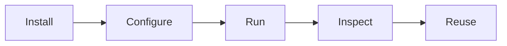
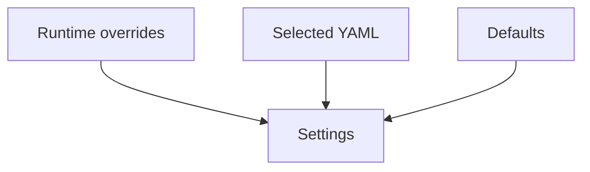
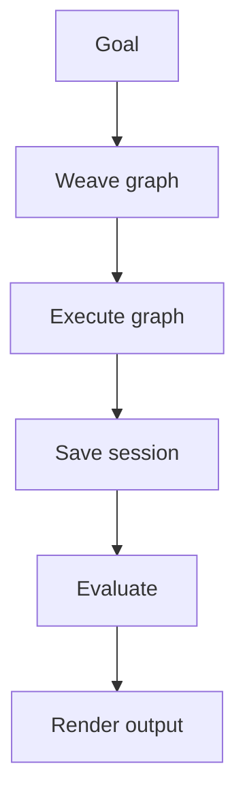
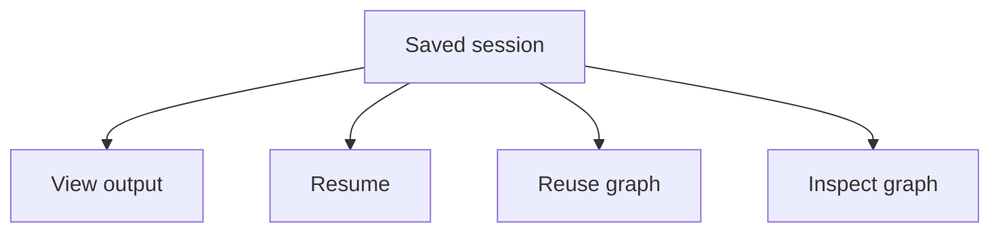

# Getting started with Arachne

This tutorial takes you from a fresh clone to your first executed agent graph.

Arachne turns a natural-language goal into a typed graph, executes the graph in dependency-aware waves, stores the session, and repairs the run when evaluation fails.



## Prerequisites

- Python **3.11 or newer**
- [`uv`](https://github.com/astral-sh/uv)
- Access to at least one LLM provider or a local Ollama model
- Git

## 1. Clone the repository

```bash
git clone https://github.com/Strategic-Automation/arachne.git
cd arachne
```

## 2. Run the quickstart wizard

```bash
./quickstart.sh
```

The wizard helps with:

1. dependency installation
2. provider selection
3. local runtime settings
4. tool availability checks
5. first-run guidance

If you prefer manual setup:

```bash
uv sync --all-groups
```

## 3. Understand the local files

Arachne keeps private credentials separate from structured settings.



| File | Purpose | Commit it? |
|---|---|---|
| local override file | private provider credentials and local overrides | No |
| `arachne.yaml` | model, budget, observability, and session settings | Usually no |
| `.venv/` | local virtual environment | No |

## 4. Run your first graph

```bash
uv run arachne run "Research the current state of humanoid robotics"
```

Arachne will:

1. parse the goal
2. weave a graph topology
3. provision tools and skills
4. execute nodes in waves
5. evaluate the result
6. persist the session



## 5. Use interactive mode for complex goals

Interactive mode gives you a chance to clarify and review the generated plan before execution.

```bash
uv run arachne run "Research a company" --interactive
```

Use it when:

- the goal is broad or ambiguous
- you want to inspect the graph before it runs
- the output affects a real decision
- you want to steer the plan while developing a workflow

## 6. Inspect your session

List recent runs:

```bash
uv run arachne ls -n 5
```

Read the latest result:

```bash
uv run arachne cat last
```

List cached graph topologies:

```bash
uv run arachne graphs
```

## 7. Reuse or resume work

Re-run a successful topology against a fresh session:

```bash
uv run arachne rerun <graph-id>
```

Resume a failed or interrupted session:

```bash
uv run arachne resume <session-id>
```



## Example workflow

```bash
# 1. Run a research goal
uv run arachne run "Map the open-source agent runtime landscape"

# 2. Inspect the result
uv run arachne cat last

# 3. List the graph cache
uv run arachne graphs

# 4. Reuse a good topology for a related goal
uv run arachne rerun <graph-id> --goal "Map the open-source evaluation framework landscape"
```

## Troubleshooting

| Symptom | Try this |
|---|---|
| `uv` is missing | Install uv, then rerun `./quickstart.sh` |
| provider credential missing | update your local settings and rerun the command |
| no cached graphs | run `arachne weave` or `arachne run` first |
| session not found | run `arachne ls` and copy the session id exactly |
| output too large | check session outputs and pointer files in the run directory |

## Next steps

- Read the [Architecture deep dive](../explanation/architecture.md)
- Browse the [CLI reference](../reference/cli.md)
- Learn how to add [custom skills](../guides/creating-skills.md)
- Review the [developer guide](../guides/developer-guide.md)
